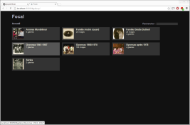
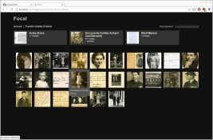
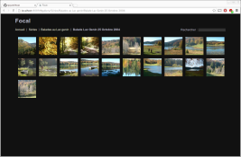
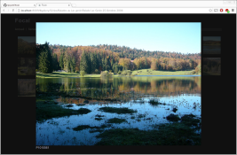

Focal - node.js picture gallery
===============================

Focal is a simple web-based picture gallery written with node.js and express.

[](doc/cap0.png) [](doc/cap1.png) [](doc/cap2.png) [](doc/cap3.png)

Requirements
------------

Focal uses mongodb to store information about images, and as it uses text search, it requires at least version 2.6.  You will also need to have the ImageMagick library and its header files installed (`libmagick++-dev` on debian-based distributions), so that Focal is able to resize images.

Installation
------------

Use npm to install Focal:

```sh
$ npm install -g focal
```

Configuration
-------------

Focal uses a JSON configuration file.  [An example configuration file](config.json) is available at the root of the repository.

Configuration key | Description
--- | ---
**galleryName** | Gallery title
**database** | Mongodb database URI (eg. `mongodb://localhost/focal`)
**server.host** | Web server IP
**server.port** | Web server port
**images.base** | Base directory for storing images. Focal should be able to write to this directory.
**images.previews.quality** | JPEG quality for image previews
**images.thumbnails.quality** | JPEG quality for image thumbnails
**images.thumbnails.size** | Thumbnail size in pixels
**images.thumbnails.crop** | Boolean; indicates whether to crop thumbnails to a square image
**log4js** | Log4js configuration (optional)

Galleries and pictures
----------------------

Focal serves pictures from the `images` subdirectory of the `images.base` directory.  You can organize pictures in folders and subfolders (with unlimited depth); Focal will display each folder as a gallery (or a sub-gallery) and will use filenames as picture titles.

Previews and thumbnails are automatically generated the first time they are served.  Focal stores them in the `previews` and `thumbs` subdirectories inside the `images.base` directory.

Focal automatically detects new and removed pictures from the `images` subdirectory.

Running Focal
-------------

From the command line:

```sh
$ focal [--config=/path/to/config.json]
```

If you don't specify the `--config` option, Focal will look for a `config.json` file inside the current directory.